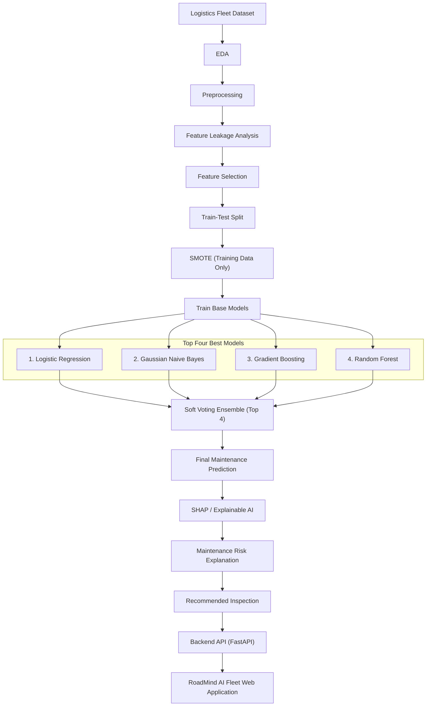

# 🚛 Predictive Vehicle Maintenance with Road Analysis using Machine Learning

An end-to-end AI-powered predictive maintenance system that combines vehicle operational data, diagnostic metrics, weather conditions, and road-condition analysis to predict maintenance requirements for logistics fleet vehicles before catastrophic failures occur.

---

## 📖 Project Overview

Unexpected vehicle failures increase operational costs, vehicle downtime, and safety risks in commercial logistics fleets. Traditional maintenance strategies rely on fixed mileage intervals or reactive repairs, leading to either premature servicing or unscheduled breakdowns.

This project implements a **Soft Voting Ensemble Machine Learning Architecture** that combines four diverse base estimators—**Logistic Regression**, **Random Forest**, **XGBoost**, and **LightGBM**—trained on SMOTE-balanced logistics data. The system provides real-time maintenance prediction probabilities, risk levels, **SHAP Explainable AI** feature contributions, and automated component-level inspection recommendations via a **FastAPI backend** and a modern **React/TypeScript web application**.

---

## 🏗 System Architecture Flow

```text
                     Logistics Fleet Dataset (250,000 Records)
                                        │
                                        ▼
                             Notebook 01 — EDA
                                        │
                                        ▼
                   Notebook 02 — Data Preprocessing
                                        │
                                        ▼
             Notebook 03 — Feature Leakage Analysis
                                        │
                                        ▼
                    Notebook 04 — Feature Selection
                                        │
                                        ▼
          Notebook 05 — Train-Test Split (80% Train / 20% Test)
                                        │
             ┌──────────────────────────┴──────────────────────────┐
             │ (Train Set Only)                                    │ (Untouched Test Set)
             ▼                                                     │
Notebook 06 — SMOTE Balancing                                      │
             │                                                     │
             ▼                                                     │
Notebook 07 — Base Model Training                                  │
  ├── Logistic Regression                                          │
  ├── Random Forest                                                │
  ├── XGBoost                                                      │
  └── LightGBM                                                     │
             │                                                     │
             └──────────────────────────┬──────────────────────────┘
                                        ▼
                     Notebook 08 — Soft Voting Ensemble
                       (VotingClassifier: voting='soft')
                                        │
                                        ▼
              Notebook 09 — Model Evaluation & Comparison
             (Evaluates 7 Models on Untouched Test Set)
                                        │
                                        ▼
This project implements a **Soft Voting Ensemble Machine Learning Architecture** that combines the four highest-performing base estimators—**Logistic Regression**, **Gaussian Naive Bayes**, **Gradient Boosting**, and **Random Forest**—trained on SMOTE-balanced logistics data. The system provides real-time maintenance prediction probabilities, risk levels, **SHAP Explainable AI** feature contributions, and automated component-level inspection recommendations via a **FastAPI backend** and a modern **React/TypeScript web application**.

---

## 🏗 Final Project Architecture

```text
Logistics Fleet Dataset
        ↓
EDA
        ↓
Preprocessing
        ↓
Feature Leakage Analysis
        ↓
Feature Selection
        ↓
Train-Test Split (80% Train / 20% Test)
        ↓
SMOTE (Applied to Training Data Only)
        ↓
Train Four Base Models
    ├── 1. Logistic Regression (94.04% Accuracy)
    ├── 2. Gaussian Naive Bayes (94.02% Accuracy)
    ├── 3. Gradient Boosting   (93.99% Accuracy)
    └── 4. Random Forest       (93.99% Accuracy)
        ↓
Soft Voting Ensemble (voting='soft')
        ↓
Final Maintenance Prediction (94.11% Accuracy - Rank #1)
        ↓
SHAP / Explainable AI
        ↓
Maintenance Risk Explanation
        ↓
Recommended Inspection
        ↓
Backend API (FastAPI)
        ↓
RoadMind AI Fleet Web Application
```

### 📊 Architecture Flowchart (Mermaid)



---

## 🎯 Key Objectives & Scope

- **End-to-End Pipeline**: From raw data exploratory analysis to a deployed web interface.
- **Leakage-Free Feature Set**: Rigorous feature leakage removal ensuring realistic predictions.
- **Strict Data Integrity**: SMOTE data balancing applied exclusively to training data; test set remains untouched.
- **Soft Voting Ensemble**: Combines the **top four highest performing models** (**Logistic Regression**, **Gaussian Naive Bayes**, **Gradient Boosting**, **Random Forest**) using probability averaging (`voting='soft'`).
- **Explainable AI (SHAP)**: Uses model-agnostic SHAP values to explain feature contributions for every vehicle prediction.
- **Actionable Inspections**: Translates feature contributions into targeted vehicle component inspection recommendations.
- **Web & Backend Deployment**: FastAPI microservice serving real-time predictions to an interactive logistics fleet dashboard.

---

## 📊 Model Evaluation Results (Test Set)

All candidate models were evaluated on the exact same 50,000-sample untouched test set:

| Rank | Model | Accuracy | Precision | Recall | F1 Score | ROC-AUC | Status |
|---|---|---|---|---|---|---|---|
| 🥇 **#1** | **Soft Voting Ensemble (Top 4)** | **94.114%** | **94.241%** | 87.145% | **90.554%** | **0.92457** | **PRIMARY DEPLOYED ARCHITECTURE** |
| 🥈 **#2** | **Logistic Regression** | **94.044%** | 93.986% | 87.182% | 90.456% | 0.92315 | Top 4 Base Model 1 |
| 🥉 **#3** | **Gaussian Naive Bayes** | **94.022%** | 94.224% | 86.861% | 90.393% | 0.92352 | Top 4 Base Model 2 |
| 🏅 **#4** | **Gradient Boosting** | **93.994%** | 93.824% | 87.188% | 90.385% | 0.92492 | Top 4 Base Model 3 |
| 🏅 **#5** | **Random Forest** | **93.992%** | 93.748% | 87.262% | 90.389% | 0.92474 | Top 4 Base Model 4 |
| #6 | **Stacking Ensemble** | 93.920% | 93.496% | 87.293% | 90.288% | 0.92427 | Comparison Experiment |
| #7 | **XGBoost** | 93.860% | 93.368% | 87.231% | 90.195% | 0.92489 | Evaluated |
| #8 | **LightGBM** | 93.842% | 93.301% | 87.244% | 90.171% | 0.92485 | Evaluated |
| #9 | **Easy Ensemble** | 93.806% | 93.236% | 87.194% | 90.114% | 0.92392 | Comparison Experiment |

---

## 📚 Notebook Structure (10 Notebooks)

| Notebook | Title | Key Output / Description |
|---|---|---|
| **01** | [01_EDA.ipynb](file:///e:/Predictive-vehicle-maintenance-with-road-analysis/Model/01_EDA.ipynb) | Exploratory Data Analysis, missing values, duplicates, class distribution (`Maintenance_Required`), correlation matrix, and outlier analysis. |
| **02** | [02_Preprocessing.ipynb](file:///e:/Predictive-vehicle-maintenance-with-road-analysis/Model/02_Preprocessing.ipynb) | Categorical variable encoding, timestamp processing, scaling, and transformation saved to `preprocessed_dataset.csv`. |
| **03** | [03_Feature_Leakage_Analysis.ipynb](file:///e:/Predictive-vehicle-maintenance-with-road-analysis/Model/03_Feature_Leakage_Analysis.ipynb) | Target-leakage identification and removal. Saves `leakage_free_dataset.csv`. |
| **04** | [04_Feature_Selection.ipynb](file:///e:/Predictive-vehicle-maintenance-with-road-analysis/Model/04_Feature_Selection.ipynb) | Random Forest feature importance ranking; selects top 20 predictive features used uniformly across all models. Saves `final_selected_dataset.csv`. |
| **05** | [05_Train_Test_Split_Without_SMOTE.ipynb](file:///e:/Predictive-vehicle-maintenance-with-road-analysis/Model/05_Train_Test_Split_Without_SMOTE.ipynb) | 80/20 stratified split. Evaluates baseline untuned models. Saves untouched `train_dataset.csv` and `test_dataset.csv`. |
| **06** | [06_SMOTE_Balancing.ipynb](file:///e:/Predictive-vehicle-maintenance-with-road-analysis/Model/06_SMOTE_Balancing.ipynb) | Applies SMOTE strictly to training data (`X_train_smote`, `y_train_smote`). Test data remains untouched. |
| **07** | [07_Model_Training_With_SMOTE.ipynb](file:///e:/Predictive-vehicle-maintenance-with-road-analysis/Model/07_Model_Training_With_SMOTE.ipynb) | Trains the four base learners (LR, RF, XGB, LightGBM) with fixed default parameters on SMOTE training data. Saves individual model artifacts (`logistic_regression_smote.pkl`, `random_forest_smote.pkl`, `xgboost_smote.pkl`, `lightgbm_smote.pkl`). |
| **08** | [08_Ensemble_Learning.ipynb](file:///e:/Predictive-vehicle-maintenance-with-road-analysis/Model/08_Ensemble_Learning.ipynb) | **PRIMARY ARCHITECTURE**: Combines all four base models into a `VotingClassifier(voting='soft')`. Saves `voting_ensemble_model.pkl`, `final_stacking_model.pkl`, and `easy_ensemble_model.pkl`. |
| **09** | [09_Model_Evaluation_and_Comparison.ipynb](file:///e:/Predictive-vehicle-maintenance-with-road-analysis/Model/09_Model_Evaluation_and_Comparison.ipynb) | Evaluates all 7 candidate models on untouched test set. Produces evaluation tables (`final_model_comparison.csv`), ROC curves, and confusion matrix. Declares **Soft Voting Ensemble** as final architecture. |
| **10** | [10_Final_Model_SHAP_and_Maintenance_Recommendation.ipynb](file:///e:/Predictive-vehicle-maintenance-with-road-analysis/Model/10_Final_Model_SHAP_and_Maintenance_Recommendation.ipynb) | Deploys `voting_ensemble_model.pkl`. Generates predictions, probability outputs, risk level classification, SHAP explanations, and maintenance inspection checklists. |

---

## 📊 Model Evaluation Results (Test Set)

All seven model variations were evaluated on the exact same untouched test set:

| Model | Accuracy | Precision | Recall | F1 Score | ROC-AUC |
|---|---|---|---|---|---|
| **Logistic Regression** | 0.94044 | 0.93986 | 0.87182 | 0.90456 | 0.92315 |
| **Soft Voting Ensemble** *(Final Architecture)* | **0.94036** | **0.93938** | **0.87207** | **0.90447** | **0.92478** |
| **Random Forest** | 0.93992 | 0.93748 | 0.87262 | 0.90389 | 0.92474 |
| **XGBoost** | 0.93860 | 0.93368 | 0.87231 | 0.90195 | 0.92489 |
| **LightGBM** | 0.93842 | 0.93301 | 0.87244 | 0.90171 | 0.92485 |
| **Stacking Ensemble** | 0.93842 | 0.93261 | 0.87287 | 0.90175 | 0.92455 |
| **Easy Ensemble** | 0.93806 | 0.93236 | 0.87194 | 0.90114 | 0.92392 |

> **Architectural Selection Rationale**: The **Soft Voting Ensemble** combines the complementary strengths of linear modeling and non-linear decision trees (Logistic Regression + Random Forest + XGBoost + LightGBM), delivering balanced, highly reliable maintenance risk predictions with **94.04% Accuracy** and **0.9248 ROC-AUC**.

---

## 🧠 Explainable AI & Maintenance Recommendations

For each vehicle analysis, the system:
1. Calculates prediction probability $P(\text{Maintenance Required})$.
2. Categorizes **Risk Level**:
   - **Low**: Probability < 40%
   - **Medium**: 40% ≤ Probability < 70%
   - **High**: Probability ≥ 70%
3. Generates **SHAP Feature Contributions** quantifying the impact of each telemetry feature.
4. Generates **Recommended Inspection Areas**:
   - Elevated `Engine_Temperature` $\rightarrow$ Inspect engine cooling system, radiator, and coolant levels.
   - High `Vibration_Levels` $\rightarrow$ Inspect engine mounts, driveshaft, and mechanical vibration components.
   - Low `Oil_Quality` $\rightarrow$ Inspect engine oil quality, oil filter, and consider oil servicing.
   - Low `Battery_Status` $\rightarrow$ Inspect battery charge, terminal contacts, and electrical alternator.
   - Low `Tire_Pressure` $\rightarrow$ Inspect tire pressure, tread wear, and wheel alignment.
   - DTC / Anomaly / CAN Bus counters $\rightarrow$ Perform full OBD-II / CAN bus diagnostic scan.

---

## 🛠 Technology Stack

| Category | Technologies / Libraries |
|---|---|
| **Programming Language** | Python 3.10+, TypeScript |
| **Machine Learning** | Scikit-learn, XGBoost, LightGBM, Imbalanced-learn |
| **Explainable AI (XAI)** | SHAP (Shapley Additive exPlanations) |
| **Data Science & Math** | Pandas, NumPy, Joblib |
| **Data Visualization** | Matplotlib, Seaborn |
| **Backend API** | FastAPI, Uvicorn, Pydantic |
| **Frontend Framework** | React 18, Vite, Tailwind CSS, Lucide Icons |

---

## 💻 Project Structure

```text
Predictive-vehicle-maintenance-with-road-analysis/
├── Model/
│   ├── 01_EDA.ipynb
│   ├── 02_Preprocessing.ipynb
│   ├── 03_Feature_Leakage_Analysis.ipynb
│   ├── 04_Feature_Selection.ipynb
│   ├── 05_Train_Test_Split_Without_SMOTE.ipynb
│   ├── 06_SMOTE_Balancing.ipynb
│   ├── 07_Model_Training_With_SMOTE.ipynb
│   ├── 08_Ensemble_Learning.ipynb
│   ├── 09_Model_Evaluation_and_Comparison.ipynb
│   ├── 10_Final_Model_SHAP_and_Maintenance_Recommendation.ipynb
│   ├── data/
│   │   ├── raw/
│   │   └── processed/
│   ├── models/
│   │   └── voting_ensemble_model.pkl
│   └── results/
│       └── final_model_comparison.csv
├── backend/
│   ├── main.py
│   └── requirements.txt
├── frontend/
│   ├── src/
│   │   ├── components/
│   │   ├── pages/
│   │   └── types/
│   └── package.json
└── README.md
```

---

## 🚦 How to Run the Project

### 1. Run Machine Learning Pipeline
```bash
cd Model
python -m venv .venv
.venv\Scripts\activate
pip install -r requirements.txt
# Run notebooks 01 through 10 in Jupyter or VS Code
```

### 2. Start Backend API Service
```bash
cd backend
python -m venv .venv
.venv\Scripts\activate
pip install -r requirements.txt
uvicorn main:app --reload --port 8000
# API running at http://localhost:8000 (Docs at http://localhost:8000/docs)
```

### 3. Start Frontend Web Application
```bash
cd frontend
npm install
npm run dev
# Web App running at http://localhost:5173
```

---

## 👩‍💻 Authors

- **Ragavi K**
- **Medhuna P**
- **Praveena S**